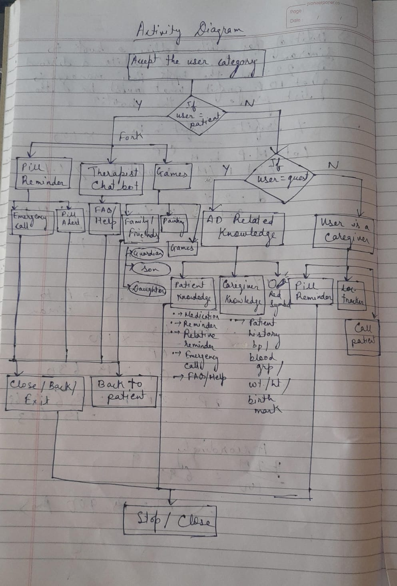

# AlzCare 💙🧠✨

Welcome to **AlzCare** — your ultimate companion app designed to support Alzheimer's patients and their caregivers with love, care, and smart technology! 🚀💪

---

## 🌟 Features That Make Life Easier & Happier 🌟

- 💊 **Medication Reminders**  
  Never miss your meds again! Get timely alerts to stay on track. ⏰✅

- 🧩 **Brain-Boosting Games**  
  Fun and simple puzzles to keep your memory sharp and your mind active! 🎲🧠

- 🚨 **Emergency SOS**  
  One-tap emergency calls to get help instantly when you need it most! 📞🔥

- 🤖 **Therapist Chatbot**  
  Your friendly AI therapist is here 24/7 to listen, support, and guide you. 💬💖

- 👥 **Caregiver Tracker**  
  Share real-time location and updates with your loved ones for peace of mind. 🗺️👨‍👩‍👧‍👦

- 🗓️ **Daily Activity Planner**  
  Organize your day with easy reminders and notes. Stay focused and calm! 📝✨

---

## 💡 Why Choose AlzCare?

Alzheimer’s is tough, but you’re not alone! AlzCare combines **technology + compassion** to make everyday life safer, happier, and more connected. Whether you’re the patient or the caregiver, this app is designed with YOU in mind! 💙🙌

---

## 🚀 Tech Stack & Packages Used

- Flutter 🐦  
- Firebase (Auth, Firestore, Messaging) 🔥  
- Provider (State Management) 📦  
- flutter_local_notifications ⏰  
- geolocator 🌍  
- dialog_flowtter 🤖  
- url_launcher 📲  

---

## 🎯 How to Use AlzCare

1. Download & install the app 📲  
2. Register as Patient or Caregiver 🧑‍⚕️👩‍⚕️  
3. Set medication reminders 💊  
4. Play memory games 🧩  
5. Chat with your AI therapist anytime 🤖💬  
6. Use emergency SOS & caregiver tracking for safety 🚨👀  

---

## 🤝 Contributions Welcome!

Want to make AlzCare even better? Feel free to open issues or submit pull requests. Let’s build a supportive community together! 💪❤️

---

## 📜 License

This project is licensed under the MIT License.

---

**AlzCare** — Caring for minds, supporting hearts, empowering lives! 💙🧠🌈

